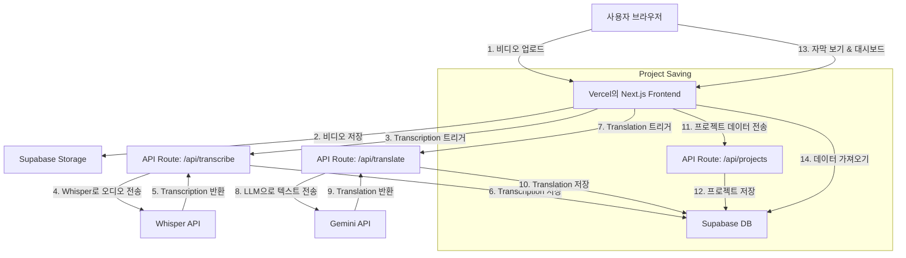

# 시스템 패턴

## 아키텍처 개요

이 애플리케이션은 최신 서버리스 아키텍처를 따르며, 프런트엔드 및 API 라우트에는 Next.js를, 백엔드 서비스에는 Supabase를 활용합니다.

## 주요 디자인 패턴

- **Serverless Functions:** 외부 API(Whisper, Gemini)와 통신하는 모든 백엔드 로직은 Next.js API Routes에 캡슐화됩니다. 이를 통해 프런트엔드와 백엔드 코드를 동일한 리포지토리에서 관리하고 배포를 단순화할 수 있습니다.
- **Backend as a Service (BaaS):** Supabase가 데이터베이스, 사용자 인증, 파일 스토리지를 처리하므로 인프라 관리보다는 핵심 애플리케이션 로직에 집중할 수 있습니다.
- **Component-Based UI:** 프런트엔드는 재사용 가능한 React 구성 요소를 사용하여 구축되어 일관성 있고 유지 관리 가능한 사용자 인터페이스를 보장합니다.
