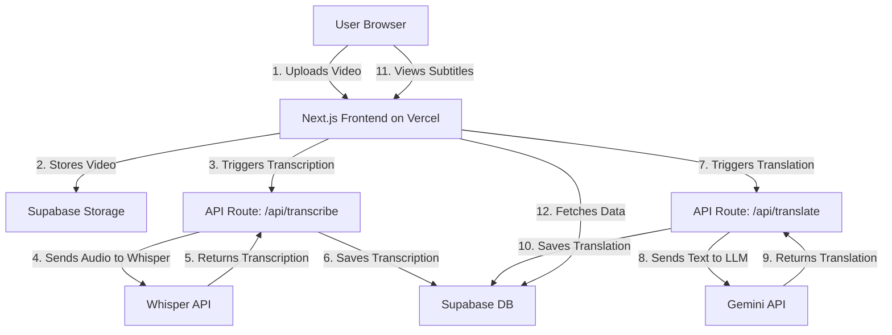

# System Patterns

## Architecture Overview

The application will follow a modern serverless architecture, leveraging Next.js for the frontend and API routes, and Supabase for backend services.

## Key Design Patterns

- **Serverless Functions:** All backend logic that communicates with external APIs (Whisper, Gemini) will be encapsulated in Next.js API Routes. This keeps the frontend and backend code in the same repository and simplifies deployment.
- **Backend as a Service (BaaS):** Supabase will handle the database, user authentication, and file storage, allowing us to focus on the core application logic rather than managing infrastructure.
- **Component-Based UI:** The frontend will be built using reusable React components to ensure a consistent and maintainable user interface.
