# 시스템 패턴

## 아키텍처 개요

이 애플리케이션은 최신 서버리스 아키텍처를 따르며, 프런트엔드 및 API 라우트에는 Next.js를, 백엔드 서비스에는 Supabase를 활용합니다.

```mermaid
graph TD
    User[사용자 브라우저] -->|1. 비디오 업로드| FE[Vercel의 Next.js Frontend];
    FE -->|2. 비디오 저장| SB_Storage[Supabase Storage];
    FE -->|3. Transcription 트리거| API_T[API Route: /api/transcribe];
    API_T -->|4. Whisper로 오디오 전송| Whisper[Whisper API];
    Whisper -->|5. Transcription 반환| API_T;
    API_T -->|6. Transcription 저장| SB_DB[Supabase DB];

    FE -->|7. Translation 트리거| API_Tr[API Route: /api/translate];
    API_Tr -->|8. LLM으로 텍스트 전송| Gemini[Gemini API];
    Gemini -->|9. Translation 반환| API_Tr;
    API_Tr -->|10. Translation 저장| SB_DB;

    subgraph Project Saving
        FE -->|11. 프로젝트 데이터 전송| API_P[API Route: /api/projects];
        API_P -->|12. 프로젝트 저장| SB_DB;
    end

    User -->|13. 자막 보기 & 대시보드| FE;
    FE -->|14. 데이터 가져오기| SB_DB;
```

## 주요 디자인 패턴

- **Serverless Functions:** 외부 API(Whisper, Gemini)와 통신하는 모든 백엔드 로직은 Next.js API Routes에 캡슐화됩니다. 이를 통해 프런트엔드와 백엔드 코드를 동일한 리포지토리에서 관리하고 배포를 단순화할 수 있습니다.
- **Backend as a Service (BaaS):** Supabase가 데이터베이스, 사용자 인증, 파일 스토리지를 처리하므로 인프라 관리보다는 핵심 애플리케이션 로직에 집중할 수 있습니다.
- **Component-Based UI:** 프런트엔드는 재사용 가능한 React 구성 요소를 사용하여 구축되어 일관성 있고 유지 관리 가능한 사용자 인터페이스를 보장합니다.
- **Page Object Model (POM):** E2E 테스트는 Page Object Model 패턴을 사용하여 구조화되어 있으며, 각 페이지의 요소와 액션을 캡슐화하여 테스트 코드의 재사용성과 유지보수성을 향상시킵니다.

## ✅ 해결된 구현 격차 (Previously Resolved)

### ✅ API vs UI 통합 문제 (해결됨)
- **✅ 구현 완료**: 개별 API Routes (`/api/transcribe`, `/api/translate`, `/api/projects`)
- **✅ 구현 완료**: 개별 React 컴포넌트들 (FileUploader, VideoPlayer, SubtitleEditor)
- **✅ 해결됨**: MainContent에서 실제 API 호출 - 더미 데이터 제거 완료

### ✅ 라우팅 및 네비게이션 격차 (해결됨)
- **✅ 구현 완료**: 대시보드에 프로젝트 목록 표시
- **✅ 해결됨**: `/project/[id]` 동적 라우트 - 대시보드 링크 정상 작동

### ✅ 데이터 플로우 완성

```mermaid
graph TD
    A[파일 업로드] --> B[Supabase Storage] 
    B --> C[MainContent]
    C --> D[✅ 실제 API 호출]
    D --> E[✅ 실제 처리 결과]
    
    style D fill:#ccffcc
    style E fill:#ccffcc
    
    F[✅ E2E 테스트] --> G[✅ 자동 검증]
    
    style F fill:#ccffcc
    style G fill:#ccffcc
```

### ✅ 핵심 패턴 준수 달성
현재 **SubTranslate**는 모든 핵심 패턴을 올바르게 구현:
- ✅ API Routes가 완전히 활용됨
- ✅ 프런트엔드-백엔드 분리 원칙 준수
- ✅ Serverless 함수의 이점을 완전 활용
- ✅ Page Object Model로 테스트 안정성 보장

## 🚨 개발 환경 관리 원칙 (CRITICAL WORKFLOW)

### 서버 실행 우선순위
1. **ALWAYS use Server Management commands from CLAUDE.md**
2. **NEVER directly run `npm run dev` unless explicitly instructed**  
3. **ALWAYS check server status before starting new processes**

### 필수 워크플로우
1. `npm run servers:status` - 현재 서버 상태 확인
2. `npm run servers:cleanup` - 기존 프로세스 정리  
3. `npm run servers:start` - 올바른 서버 시작

### 포트 충돌 방지
- 직접 `npm run dev` 실행 시 포트 3000 충돌 위험
- 정의된 서버 관리 스크립트 사용으로 안정성 확보
- 개발 환경 일관성 유지

### CLAUDE.md 우선 참조 원칙
- 모든 명령어 실행 전 CLAUDE.md 확인 필수
- Server Management 섹션의 명령어가 Essential Commands보다 우선
- 서버 관리 워크플로우: status → cleanup → start 순서 준수

### 메모리 뱅크 업데이트 정의
**"메모리 뱅크 업데이트"** (Korean) / **"update memory bank"** (English) includes:
- CLAUDE.md 파일 업데이트
- memory-bank/ 폴더의 모든 마크다운 파일 업데이트
- 프로젝트 패턴, 워크플로우, 중요한 결정사항 문서화
